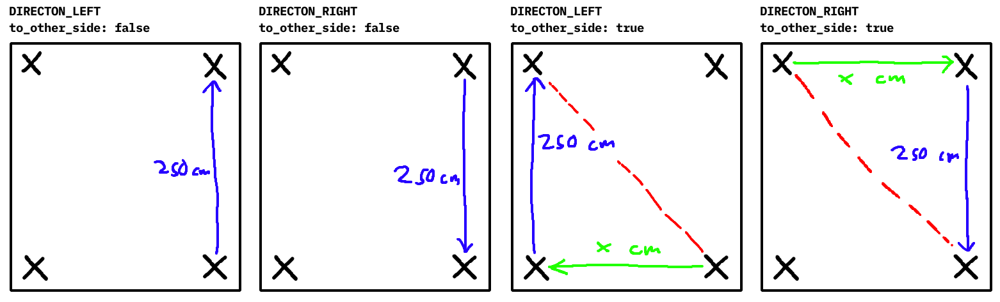

# Översikt över robotens uppgifter

**Steg 1 "Hitta vägg och justera"**

När roboten startar befinner den sig 50 cm från en vägg i en slumpmässig riktning (360 graders frihet). För att roboten ska kunna navigera och leverera paketet 0-30 cm från väggen behöver den först veta vart väggen befinner sig.

**Roboten borde:**
* Rotera långsamt ett helt varv och spara den vinkel då distansen till väggen var närmast
* *Möjligtvis* utföra testet flera gånger och ta ett medelvärde (testning behövs för att se om det är nödvändigt eller om sensor är bra nog för att endast användas en gång)

**Om destination är vänster/höger (`to_other_side = false`):**
* Vända sig till den sparade vinkeln
* Positionera sig 50 cm från den väggen
* Återställa/kalibrera gyro sensor och använda det här som utgångspunkt för resten av leveransen

**Om destination är tvärs över vänster/höger (`to_other_side = true`):**
* Vända sig 180 grader från den sparade vinkeln
* Åka rakt över korridoren tills den hittar väggen på andra sidan
* Positionera sig 50 cm från den väggen
* Återställa/kalibrera gyro sensor och använda det här som utgångspunkt för resten av leveransen
* Byt `DIRECTION_LEFT` till `DIRECTION_RIGHT` och tvärtom. Det här behövs efter roboten har vänt sig 180 grader, det som tidigare var vänster för roboten är nu höger.

**Steg 2 "Åk och undvik objekt"**

I den här fasen befinner sig roboten riktad mot väggen som den ska åka brevid. Roboten är ca 50 cm från väggen.

**Roboten borde:**
* Rotera åt rätt håll (+-90 grader) för att börja leveransen
* Åka 250 cm rakt framåt och hålla koll på ultrasonic sensorn för att se om något är i vägen

Roboten borde hela tiden hålla koll på hur långt det är kvar. Om den märker att sensorn tar upp något närmare än väntat (till exempel att det är 100 cm kvar till slutpunkten och det finns något 50 cm fram) så borde den göra följande:
* Vända sig bort från väggen
* Åka 20 cm
* Vänd tillbaka till rätt håll och kolla om det fortfarande finns något framför den

Om det fortfarande finns något framför den repeterar den förra steget. Om det är fritt fram måste den:
* Åka lite till så att den vet att varken roboten eller boken kan krocka med hindret
* Vänd tillbaka till rätt håll
* Åka 50 cm
* Vända sig mot väggen och kolla om det fortfarande finns ett hinder

Roboten repeterar det fram tills hindret är borta. Om roboten har åkt 250 cm eller om det är borta så vänder den sig tillbaka mot väggen och åker in så att den befinner sig rätt för att släppa av boken.

Den ger alltså upp med att undvika hindret om den är framme vid slutpunkten.

**Steg 3 "Släpp av bok"**

TODO

**Steg 4 "Hitta tillbaka till startpunkt"**

TODO