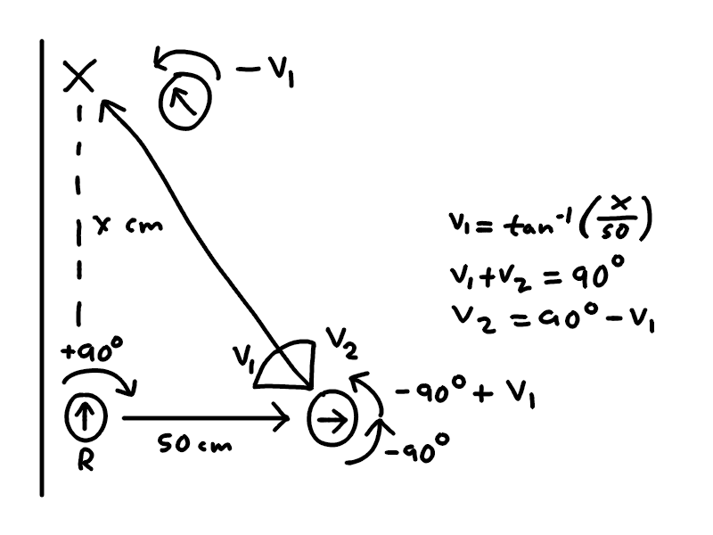

# Översikt över robotens uppgifter

**Steg 1 "Hitta vägg och justera"**

När roboten startar befinner den sig 50 cm från en vägg i en slumpmässig riktning (360 graders frihet). För att roboten ska kunna navigera och leverera paketet 0-30 cm från väggen behöver den först veta vart väggen befinner sig.

**Roboten borde:**
* Rotera långsamt ett helt varv och spara den vinkel då distansen till väggen var närmast
* *Möjligtvis* utföra testet flera gånger och ta ett medelvärde (testning behövs för att se om det är nödvändigt eller om sensor är bra nog för att endast användas en gång)

**Om destination är vänster/höger (`to_other_side = false`):**
* Vända sig till den sparade vinkeln
* Positionera sig 50 cm från den väggen
* Återställa/kalibrera gyro sensor och använda det här som utgångspunkt för resten av leveransen

**Om destination är tvärs över vänster/höger (`to_other_side = true`):**
* Vända sig 180 grader från den sparade vinkeln
* Åka rakt över korridoren tills den hittar väggen på andra sidan
* Positionera sig 50 cm från den väggen
* Återställa/kalibrera gyro sensor och använda det här som utgångspunkt för resten av leveransen
* Byt `DIRECTION_LEFT` till `DIRECTION_RIGHT` och tvärtom. Det här behövs efter roboten har vänt sig 180 grader, det som tidigare var vänster för roboten är nu höger.

**Steg 2 "Åk och undvik objekt"**

I den här fasen befinner sig roboten riktad mot väggen som den ska åka brevid. Roboten är ca 50 cm från väggen.

**Roboten borde:**
* Rotera åt rätt håll (+-90 grader) för att börja leveransen
* Åka 250 cm rakt framåt och hålla koll på ultrasonic sensorn för att se om något är i vägen

Förklaring för "undvik objekt":

**Steg 3 "Släpp av bok"**

TODO

**Steg 4 "Hitta tillbaka till startpunkt"**

TODO

#En ide för hur roboten ska undvika hinder på väg till andra X'et
!.[.](hinder1.1.jpg)
!.[.](hinder1.2.jpg)

Om roboten hittar någonting i 20 cm framför sig den stoppar, vänder sig 45 grader och skanar för andra närligander objekt.

Ifall det finns inte då:
TODO

Ifall det finns då:
spara vinkel för den närligande objekt, lägg till 10 grader på den och kör en viss avstånd sen vända sig igen mot X och kör tills den når den.
