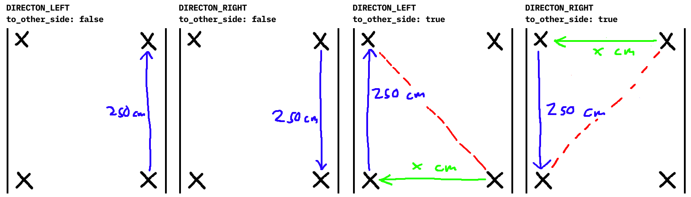

# Översikt över robotens uppgifter

**Steg 1 "Hitta vägg och justera"**

När roboten startar befinner den sig 50 cm från en vägg i en slumpmässig riktning (360 graders frihet). För att roboten ska kunna navigera och leverera paketet 0-30 cm från väggen behöver den först veta vart väggen befinner sig.

**Roboten borde:**
* Rotera långsamt ett helt varv och spara den vinkel då distansen till väggen var närmast
* *Möjligtvis* utföra testet flera gånger och ta ett medelvärde (testning behövs för att se om det är nödvändigt eller om sensor är bra nog för att endast användas en gång)

**Om destination är vänster/höger (`to_other_side = false`):**
* Vända sig till den sparade vinkeln
* Återställa/kalibrera gyro sensor och använda det här som utgångspunkt för resten av resan

**Om destination är tvärs över vänster/höger (`to_other_side = true`):**
* Vända sig 180 grader från den sparade vinkeln
* Åka rakt över korridoren tills den hittar väggen på andra sidan
* Positionera sig ca 50 cm från den väggen
* Återställa/kalibrera gyro sensor och använda det här som utgångspunkt för resten av resan
* Byt `DIRECTION_LEFT` till `DIRECTION_RIGHT` och tvärtom. Det här behövs efter roboten har vänt sig 180 grader, det som tidigare var vänster för roboten är nu höger.

**Steg 2 "Åk och undvik objekt"**

TODO

**Steg 3 "Släpp av bok"**

TODO

**Steg 4 "Hitta tillbaka till startpunkt"**

TODO